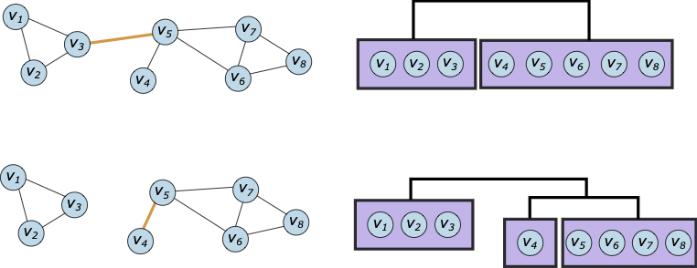
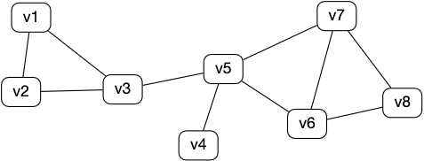
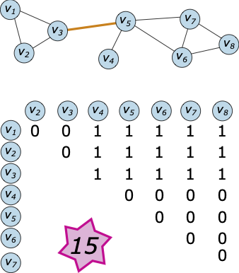
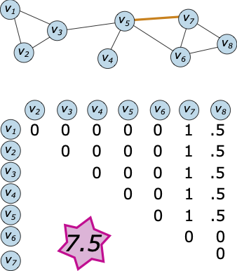
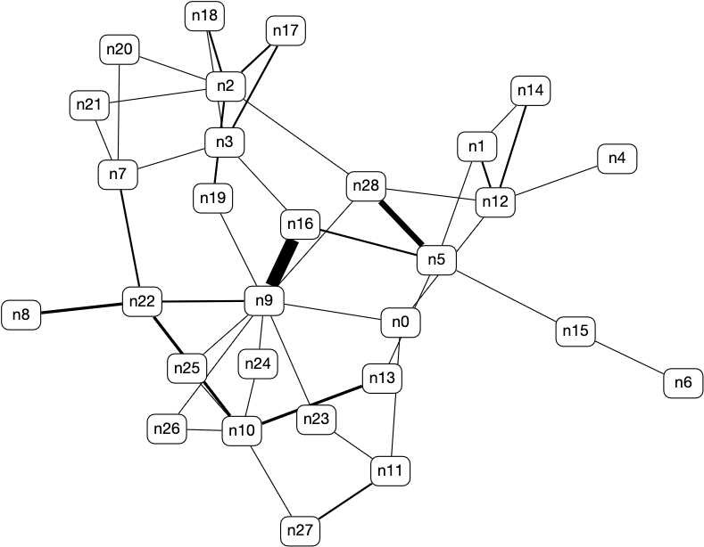

# Lab 6 Part 2: Community Detection

In this lab, you will implement the Girvan-Newman community detection method.  This method is from the paper [Community Structure in Social and Biological Networks](https://arxiv.org/pdf/cond-mat/0112110v1.pdf) (PNAS 2002), and is named after the two authors.  

## :star: **Task A:** Overview & Pseudocode

This divisive algorithm has the following steps:

1. Assign all nodes to a single cluster.

2. Calculate the _edge betweenness_ of all edges in the network.  You are given a `lab_utils.get_betweenness_dictionary()` that returns a dictionary of (node,edge betweenness) values.

3. Remove the edge with the highest betweenness. You are given a `lab_utils.remove_edge()` function that removes the edge from the edge list and adjacency list.

4. If removing the edge `(u,v)` means that `u` and `v` are no longer in the same connected component, replace the single cluster containing `u` and `v` with two clusters, one that contains `u` and one that contains `v`.

3. Repeat from Step 2 until no edges remain to remove.



The method you write should output a partition/grouping that increases the number of groups by one each time. Note that this is a _single_ list, where each element of the list is a partition of nodes.

```
[[['v1', 'v2', 'v3', 'v4', 'v5', 'v6', 'v7', 'v8']]
[['v1', 'v2', 'v3'], ['v4', 'v5', 'v6', 'v7', 'v8']]
[['v1', 'v2', 'v3'], ['v4'], ['v5', 'v6', 'v7', 'v8']]
[['v1', 'v2', 'v3'], ['v4'], ['v5'], ['v6', 'v7', 'v8']]
[['v1', 'v2'], ['v3'], ['v4'], ['v5'], ['v6', 'v7', 'v8']]
[['v1'], ['v2'], ['v3'], ['v4'], ['v5'], ['v6', 'v7', 'v8']]
[['v1'], ['v2'], ['v3'], ['v4'], ['v5'], ['v6'], ['v7', 'v8']]
[['v1'], ['v2'], ['v3'], ['v4'], ['v5'], ['v6'], ['v7'], ['v8']]]
```

**As a group, spend 15-20 minutes outlining the pseudocode for this function.**  Some questions to consider:
- How do you know when to partition a cluster? Is there any previous code that might help this?
- What is the stopping criterion for partitioning?
- How should you build the output data structure so you can return all partitions in the hierarchical clustering?

Talk through your pseudocode with Anna before continuing.

## :star: **Task B:** Preliminaries & Provided Methods

First, _clone this repository_ using the GitHub Desktop.  You will not need to commit your code in this lab, but it's good practice to start cloning repositories. Navigate to the location on your computer where the repository is cloned and open `lab6.py` and `lab_utils.py` starter code.

Next, you will need to install a graph library called [`networkx`](https://networkx.github.io/documentation/stable/index.html).  Install instructions are [available on the website](https://networkx.github.io/documentation/stable/install.html), or you can use the package manager that is supplied with Anaconda/Spyder.  You can install `networkx` in the same way you installed `matplotlib` in an earlier lab.

Once you have done the two steps above, you should be able to replace the username and password with your own GraphSpace information and post the example graph.



### Provided Methods

There are two methods that will be useful for your implementation:

**1. lab_utils.get_betweenness_dictionary()**

This function takes two arguments -- `edges` and `costs` -- and returns a dictionary where the keys are edges and the values are the edge betweeness centrality.  This function relies on `networkx` commands. In the first iteration of the algorithm, the dictionary contains the following values:

```
#key   value
('v1', 'v2') 1.0
('v1', 'v3') 6.0
('v2', 'v3') 6.0
('v3', 'v5') 15.0
('v5', 'v6') 7.5
('v5', 'v7') 7.5
('v5', 'v4') 7.0
('v6', 'v8') 3.5
('v6', 'v7') 1.0
('v8', 'v7') 3.5
```

This is consistent with these calculations for edges `(v3,v5)` and `(v7,v8)`:





**2. lab_utils.remove_edge(e,edges,adj_list)**

This function takes three arguments - an edge `e` (a key from the centralities dictionary), an edge list, and an adjacency list.  It removes `e` from both the edge list and the adjacency list.  This function does not return any values, since these removals happen directly to the variables. You can confirm with the following lines, as a sanity check:

```
print(len(edges))
lab_utils.remove_edge(edges[0],edges,adj_list)
print(len(edges))
```

## :star: **Task C:** Write a Community Detection algorithm

Following the lab's pseudocode, implement the rest of the Girvan-Newman algorithm.  This function should return a single list that captures all partitions of the graph.  My function definition has four arguments:

```
def get_communities(nodes,edges,costs,adj_list):
```

However, you may choose to use different variables.

:question: Watch out for removing elements of lists/dictionaries if your FOR loop is iterating over those lists.  You can pass the `copy_edges` list into the community detection method so you don't lose edges for visualizing.

Once you have a partition of nodes, you can post a colored version of the graph by passing in a single partition (an element of the returned list) as the last argument to the `viz_graph()` function.

## :star: **Task D:** Apply the Community Detection Algorithm to a Mouse Connectome

This mouse network is from [Neurodata](https://neurodata.io/project/connectomes/), a repository of connectomes.  The network is from [Network anatomy and in vivo physiology of visual cortical neurons](https://www.nature.com/articles/nature09802) by Bock et al. (Nature 2011).  It represents the mouse primary visual cortex based on identifying neurons' local network from electron microscopy.  Components of this network are shown in Figures 5b & 5c below:


Run the Girvan Newman on this network (the edges are stored in `'mouse_visual_cortex_edges.txt'`) and visualize some number of communities in GraphSpace.



## Submitting

:star2: **You're Done with Tasks A-D!**  No code handin is required. Instead, you will share your Example and Mouse networks colored by communities (and any saved layouts) with the `BIO331F20` Group.  
